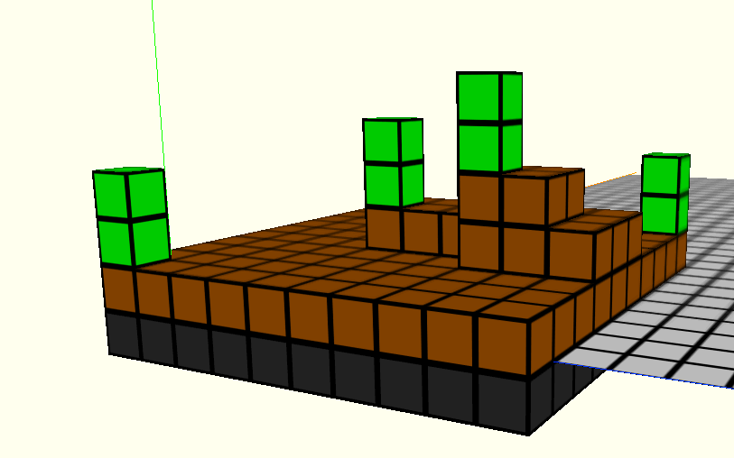

3Dsim
=====

kdb+/k/q web socket server running a tick-based 3D world simulation; each cell lives and acts independently. 

Three.js Voxel Painter, created by [Stemkoski/mrdoob](https://github.com/stemkoski/stemkoski.github.com), connects via web sockets to the kdb+/k/q process in order to render the JSON-encoded simulation data in 3D.

Dependencies
------------
- [kdb+/k/q](http://kx.com/software-download.php)
- Static web server, such as NodeJS with node-static

To run
------
1. Start the kdb+/k/q web socket server:
	- Linux: /path/to/q/l32/q /path/to/backend.q -p 4321
	- Windows: /path/to/q/w32/q /path/to/backend.q -p 4321

2. Start the static web server:
	- /path/to/node_modules/.bin/static /path/to/ThreeJSUI

3. Browse to http://localhost:8080/Voxel-Painter.html